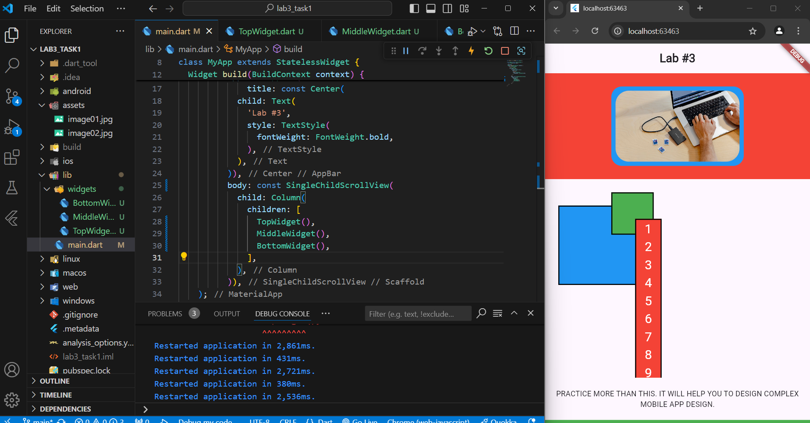
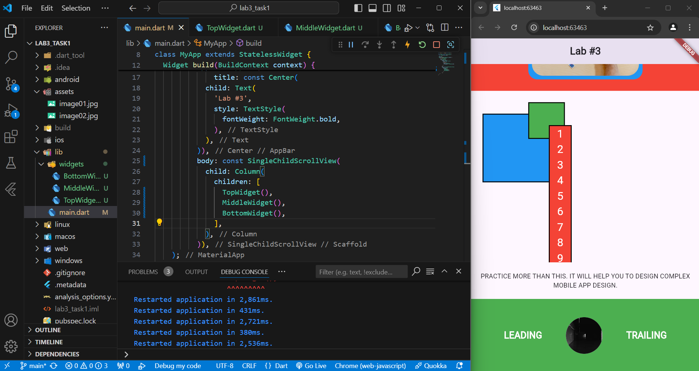

# Flutter App for Lab 3 Task 2

This Flutter application is created as part of Lab 3 Task 2 for the Mobile App Development course. The task involves implementing a Flutter app based on a provided design.

## Overview

The application showcases various Flutter widgets and layout techniques to achieve the desired design. It includes features such as custom layout, image handling, and responsive design.

## Features

- **Responsive UI**: The app adjusts to different screen sizes and orientations.
- **Custom Layout**: Implementation of complex layouts using Flutter's `Row`, `Column`, `Stack`, and other widgets.
- **Image Handling**: Display of images using `Image` widget with proper scaling and placement.

## Screenshots




## Getting Started

Follow these instructions to set up the project locally on your machine.

### Prerequisites

- Ensure you have [Flutter](https://flutter.dev/docs/get-started/install) installed on your machine.
- Set up an IDE (e.g., Visual Studio Code, Android Studio) with Flutter support.

### Installation

1. **Clone the repository:**
   ```bash
   git clone https://github.com/your-username/widget_app.git
